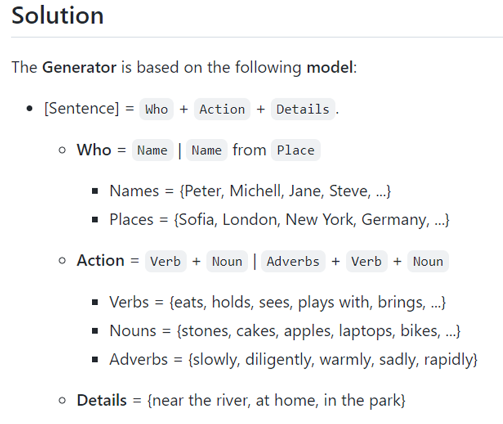
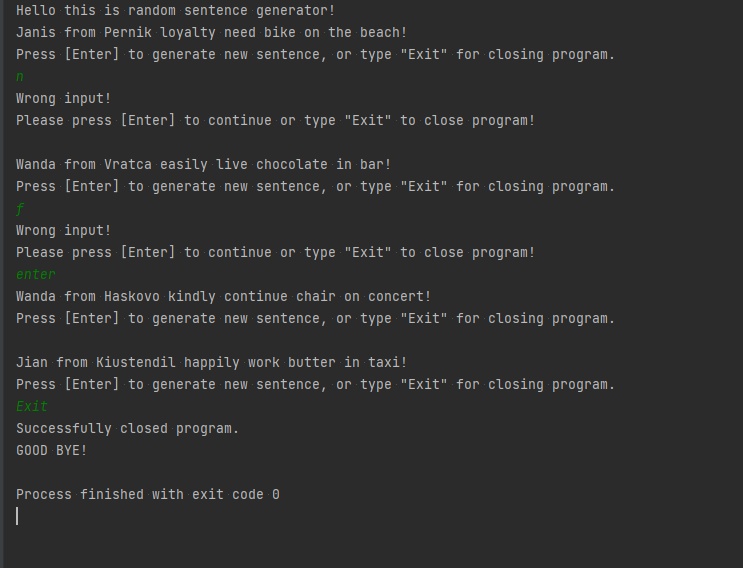

Random sentence generator. 

Small Project 03.

[Replit Link](https://replit.com/@qceka88/The-generator#main.py) to try it!

This small project is part from my education in [SoftUni](https://softuni.bg/),
[Programming Fundamentals with Python - September2022](https://softuni.bg/trainings/3840/programming-fundamentals-with-python-september-2022)

Basicly this generator create a sentence from five words.
Name, Place, Verb, Noun, Adverb, Detail. Some of the ramdom
generated sentences have non sence. But this program is create
only for having fun. 

In the picture below are shown few examples of this program.

